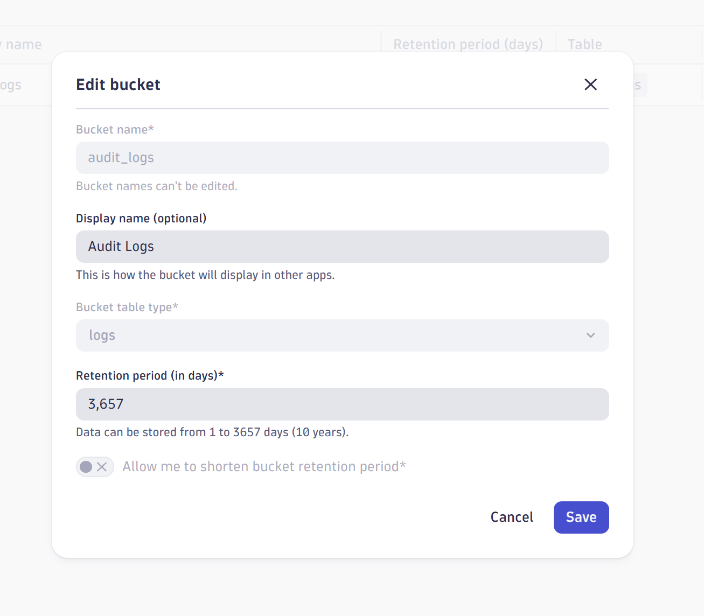
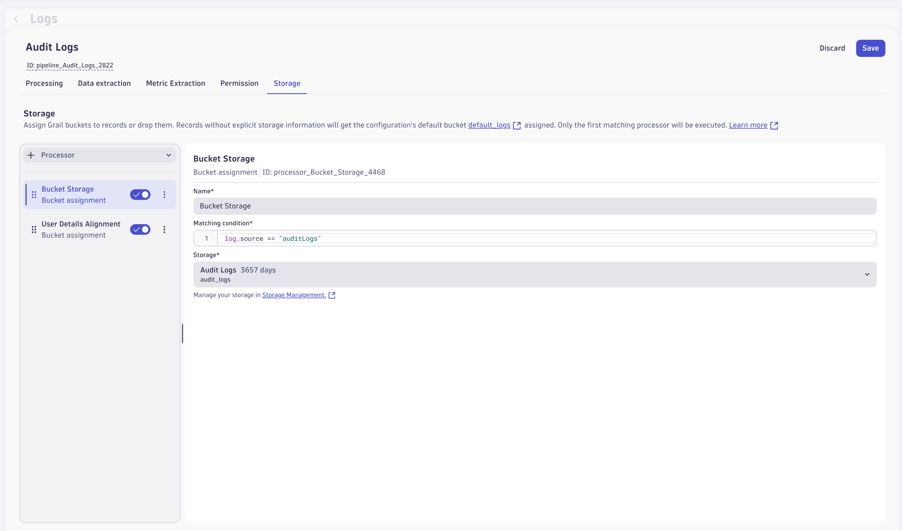
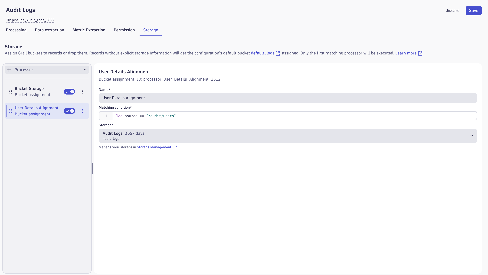
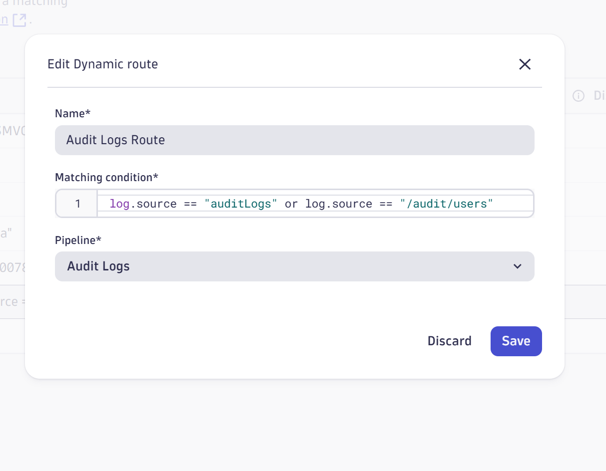
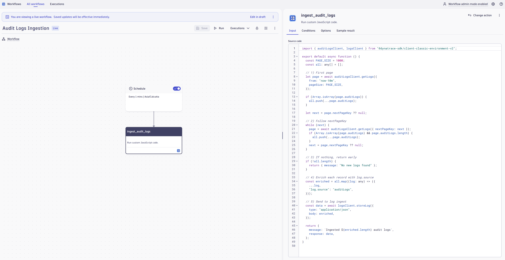
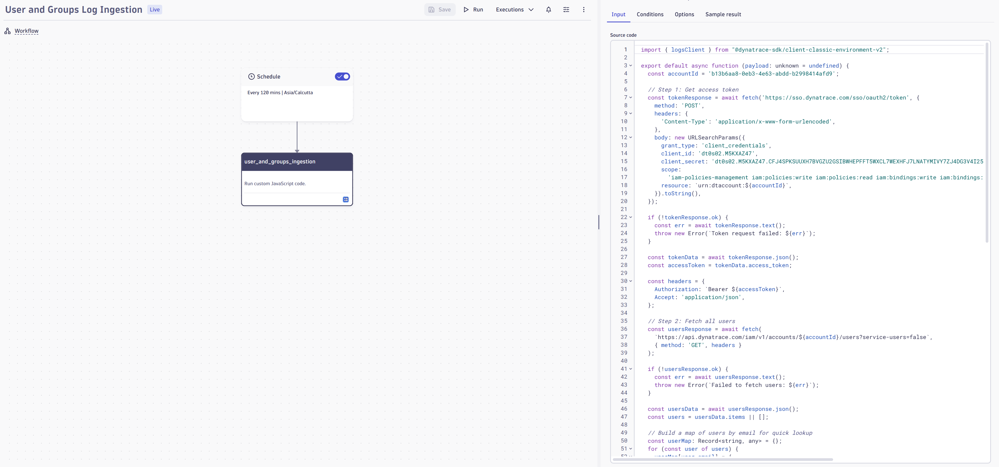
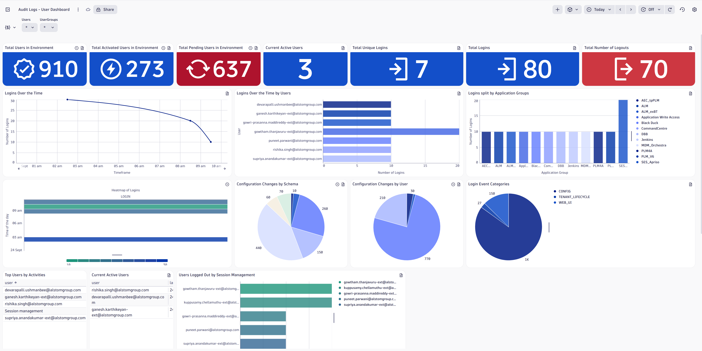
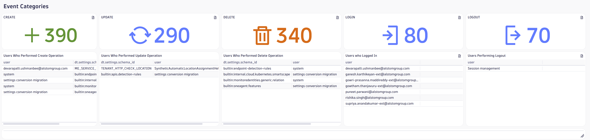
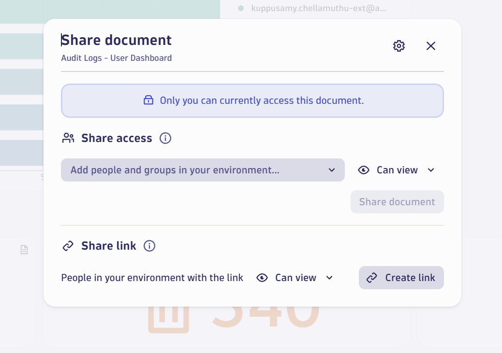

# 📊 Audit Logs Dashboard - Implementation Guide

This document outlines the complete setup process for creating a comprehensive audit logs dashboard in Dynatrace for monitoring user activities and security events.

---

## Table of Contents

1. [Business Justification](#-business-justification)
   - [Why Organizations Need This Dashboard](#-why-organizations-need-this-dashboard)
   - [User Management & License Optimization](#user-management--license-optimization)
   - [Authentication & Security Monitoring](#authentication--security-monitoring)
   - [Configuration Change Management](#️-configuration-change-management)
   - [Environment Health & API Monitoring](#-environment-health--api-monitoring)
   - [Operational Intelligence & Troubleshooting](#-operational-intelligence--troubleshooting)
   - [Practical Business Value](#-practical-business-value)
   - [Measurable Outcomes](#-measurable-outcomes)

2. [Implementation Steps](#implementation-steps)
   - [Step 1: Storage Setup - Create Audit Logs Bucket](#step-1-storage-setup---create-audit-logs-bucket)
   - [Step 2: Data Pipeline Configuration - OpenPipeline Setup](#step-2-data-pipeline-configuration---openpipeline-setup)
   - [Step 3: Automated Data Ingestion - Workflow Creation](#step-3-automated-data-ingestion---workflow-creation)
   - [Step 4: Dashboard Creation - Data Visualization](#step-4-dashboard-creation---data-visualization)
   - [Step 5: Collaboration & Access Management](#step-5-collaboration--access-management)

3. [Dashboard Metrics & Available Data](#dashboard-metrics--available-data)
   - [User Management Metrics](#user-management-metrics)
   - [Authentication Analytics](#authentication-analytics)
   - [User Activity Intelligence](#user-activity-intelligence)
   - [Configuration Management Tracking](#configuration-management-tracking)
   - [Detailed User Activity Data](#detailed-user-activity-data)
   - [Time-based Analytics](#time-based-analytics)
   - [Security and Compliance Data](#security-and-compliance-data)
   - [Interactive Features](#interactive-features)

---

## 💼 Business Justification

### 🎯 **Why Organizations Need This Dashboard**

This audit logs dashboard provides essential visibility into Dynatrace environment usage patterns, security events, and system health. Based on the actual metrics and visualizations available, organizations gain practical insights for operational management and compliance requirements.

#### **User Management & License Optimization**

The dashboard provides concrete metrics for managing user resources:

- **Total Users Tracking**: Monitor total users vs. activated users to optimize license utilization
- **Current Active Users**: Real-time view of current active users for capacity planning
- **Pending User Management**: Track pending users to streamline user activation processes
- **Application Group Analytics**: Visualize login patterns across different user groups and applications
- **User Activity Tracking**: Monitor individual user behavior and identify inactive accounts

#### **Authentication & Security Monitoring**

Track critical security metrics with detailed login analytics:

- **Login Event Tracking**: Monitor total logins and logout events for session management
- **Login Patterns Analysis**: Time-series visualization showing login trends over days/hours
- **User Session Management**: Track users logged out by session management policies
- **Authentication Trends**: Identify peak usage times and unusual login patterns
- **Security Event Categories**: Monitor CREATE, UPDATE, DELETE operations by user

#### ⚙️ **Configuration Change Management**

Maintain visibility into system modifications:

- **Configuration Changes by Schema**: Pie chart breakdown of changes across different system components
- **Configuration Changes by User**: Track which users are making system modifications
- **Change Event Categorization**: Detailed view of create, update, and delete operations
- **Change Timeline Tracking**: Historical view of configuration modifications over time

#### 🌐 **Environment Health & API Monitoring**

Monitor system performance and API usage:

- **API Token Usage**: Track API tokens in use for resource management
- **API Calls to ActiveGate**: Monitor POST requests and system communication patterns
- **Network Traffic Analysis**: Track incoming/outgoing network traffic to/from clients and Dynatrace environment
- **Agent Module Connectivity**: Monitor connection status of various agent modules
- **Problem Severity Tracking**: Monitor ERROR, AVAILABILITY, RESOURCE_CONTENTION, and PERFORMANCE issues
- **Log Ingestion Trends**: Track log volume patterns over time periods

#### 🔍 **Operational Intelligence & Troubleshooting**

Gain insights for daily operations:

- **Top Users by Activity**: Identify most active users and their system interactions
- **Login Heat Map**: Visual representation of login activity patterns throughout the day
- **Network Performance Monitoring**: Track network traffic patterns and identify potential bottlenecks
- **REST API Usage**: Monitor API call volumes and identify usage trends
- **System Health Indicators**: Real-time view of dropped, resent, and rejected messages

### 💡 **Practical Business Value**

#### **For IT Operations Teams**

- **Resource Planning**: Use user activation metrics to optimize license costs
- **Capacity Management**: Monitor current active users and peak login times for infrastructure planning
- **Change Tracking**: Visibility into who made what configuration changes and when
- **Performance Monitoring**: Track API usage patterns and network health metrics

#### **For Security Teams**

- **Access Monitoring**: Real-time view of login/logout patterns and active sessions
- **Change Auditing**: Complete trail of configuration modifications by user
- **Anomaly Detection**: Identify unusual login patterns or excessive configuration changes
- **Session Management**: Monitor forced logouts and session timeout events

### 📈 **Measurable Outcomes**

Based on the dashboard's metrics, organizations can expect:

- **Security Incident Response**: Faster identification of unauthorized changes through user-specific change tracking
- **Operational Efficiency**: Proactive monitoring of API usage patterns and system health indicators
- **Compliance Readiness**: Complete audit trail of user actions, logins, and configuration changes available on-demand

---

## Pre-requisites

- Access to Dynatrace environment with permissions to create storage buckets, data pipelines, workflows, and dashboards.
- Ensure you have ```storage:logs:write``` permission enabled in your user.
- Having OAuth token ID, Secret and URN if not please configure form OAuth clients from Account Management portal.

### ⚠️ **Important Licensing Notice**

**Note**: This solution consumes Log Management ingest, processing, retention, and query execution quotas. All usage is billed under Dynatrace Log Management licensing as per the DPS rate card.

---

## Implementation Steps

### Step 1: Storage Setup - Create Audit Logs Bucket

Set up dedicated storage for audit logs data through Dynatrace Storage Management.



**Purpose:** Establishes a dedicated storage bucket (`audit_logs`) to store and manage all audit log data efficiently.

---

### Step 2: Data Pipeline Configuration - OpenPipeline Setup

Configure data routing and processing rules for different types of audit logs.

#### **Audit Logs Pipeline Configuration**



**Matching Condition:**
```text
log.source == "auditLogs"
```

#### 👥 **User Management Logs Pipeline Configuration**



**Matching Condition:**
```text
log.source == "/audit/users"
```

#### 🔀 **Dynamic Route Configuration**



**Combined Matching Condition:**
```text
log.source == "auditLogs" OR log.source == "/audit/users"
```

**Benefits:**
- Automated log categorization
- Efficient data routing
- Separation of concerns between general audit logs and user-specific logs

---

### Step 3: Automated Data Ingestion - Workflow Creation

Set up automated workflows to fetch and store audit logs every 10 minutes.

#### **Audit Logs Ingestion Workflow**



**Features:**
- Automated data fetching from Alstom API
- Scheduled execution every 10 minutes
- Error handling and retry logic

**Download:** [Audit Logs Ingestion Workflow JSON](assets/wf_audit_logs_ingestion_19016ca5-cc4d-4b63-b18e-5eb47973979b.json)

#### **User & Groups Data Workflow**



**Features:**
- User and group information synchronization
- Enhanced user context for audit analysis
- Access control data integration

**Download:** [User & Groups Workflow JSON](assets/wf_user_and_groups_log_ingestion_6f42c440-5256-48c9-bb0f-8a244c795a8f.json)

---

### Step 4: Dashboard Creation - Data Visualization

Create comprehensive dashboards with multiple visualization tiles for audit log analysis.

#### **Dashboard Overview**



#### **Detailed Analytics View**



**Download:** [Dashboard](assets/AuditLogsDashboard.json)

---

### Dashboard Metrics & Available Data

This section outlines all the metrics and data insights available in the Alstom Audit Logs Dashboard based on the implemented tiles.

#### **User Management Metrics**

**User Population Overview:**
- **Total Users in Environment** - Complete count of all users configured in the system
- **Total Activated Users** - Number of users with ACTIVE status ready to use the system
- **Total Pending Users** - Users in PENDING state awaiting activation
- **Current Active Users** - Real-time count of currently logged-in users (table view with last login details)

#### **Authentication Analytics**

**Login Activity Tracking:**
- **Total Logins** - Complete count of all login events recorded
- **Total Unique Logins** - Number of distinct users who have logged in
- **Logins Over Time** - Time series visualization showing login trends with hourly intervals
- **Login Heatmap** - Visual heatmap showing login patterns throughout the day
- **Logins by Application Groups** - Login distribution across different user groups

**Session Management:**
- **Total Number of Logouts** - Complete count of logout events (including automatic logouts)
- **Users Logged Out by Session Management** - Breakdown of automatic system logouts by user
- **Manual vs Automatic Logout Tracking** - Distinction between user-initiated and system-initiated logouts

#### **User Activity Intelligence**

**Activity Analysis:**
- **Top Users by Activities** - Ranking of most active users with detailed activity breakdown
- **Login Event Categories** - Categorization of login events (successful, failed, etc.)
- **Users Who Logged In** - Complete list of users with login activity
- **Users Performing Logout** - List of users who manually logged out

#### **Configuration Management Tracking**

**CRUD Operations Monitoring:**
- **CREATE Operations** - Count and details of resource/configuration creation events
- **UPDATE Operations** - Count and details of modification events
- **DELETE Operations** - Count and details of deletion events
- **Users by Operation Type** - Detailed tables showing which users performed specific operations

**Schema-based Analytics:**
- **Configuration Changes by Schema** - Visual breakdown of changes grouped by configuration schema
- **Configuration Changes by User** - Per-user analysis of configuration modifications
- **Schema-User Relationship Mapping** - Detailed tables linking users to specific schema modifications

#### **Detailed User Activity Data**

For each active user, the dashboard provides:

**Individual User Metrics:**
- User identifier and email
- Last login timestamp (ISO format and local time)
- Login origin information
- Total event count per user
- Event type breakdown (LOGIN, LOGOUT, CREATE, UPDATE, DELETE)
- Category-wise activity distribution
- Recent activity history (last 5 actions per user)
- Session information and duration tracking

**Activity Context Data:**
- **Event Types:** LOGIN, LOGOUT, CREATE, UPDATE, DELETE
- **Categories:** Various event categories for classification
- **Success Status:** Success/failure tracking for each event
- **Schema Information:** Configuration schema details for settings changes
- **Scope Information:** Scope names for configuration changes
- **Environment Data:** Environment ID tracking
- **User Origin:** Source/method of user authentication

#### **Time-based Analytics**

**Temporal Insights:**
- **Hourly Activity Distribution** - Activity patterns across 24-hour periods
- **Peak Usage Identification** - Automatic detection of high-activity time periods
- **Login Trend Analysis** - Historical login pattern analysis with forecasting capabilities
- **Session Duration Tracking** - Analysis of user session lengths and patterns

#### **Security and Compliance Data**

**Audit Trail Information:**
- **Complete User Action History** - Chronological record of all user actions
- **Configuration Change Audit** - Detailed tracking of system configuration modifications
- **Access Pattern Analysis** - User behavior and access pattern insights
- **Session Management Monitoring** - Automatic logout tracking and session timeout analysis

#### **Interactive Features**

**Dashboard Variables:**
- **User Filter** - Interactive filtering by specific users
- **User Group Filter** - Filter by application/user groups
- **Time Range Selection** - Configurable timeframe analysis (default: daily view)

**Visualization Types:**
- **Single Value Metrics** - KPI counters with color-coded thresholds
- **Time Series Charts** - Trend analysis with smooth curve visualization
- **Pie Charts** - Distribution analysis for categories and groups
- **Bar Charts** - Comparative analysis across users and groups
- **Tables** - Detailed drill-down data with sortable columns
- **Heatmaps** - Time-based activity pattern visualization

This comprehensive dashboard provides stakeholders with complete visibility into user behavior, system security, configuration changes, and operational patterns within the Alstom environment.

---

### Step 5: Collaboration & Access Management

Share the dashboard with relevant stakeholders for collaborative monitoring and analysis.



**Sharing Features:**

- **Role-based Access Control** - Different permission levels for various stakeholders
- **Automated Reporting** - Scheduled dashboard reports via email
- **Direct Link Sharing** - Easy access for team members
- **Mobile Accessibility** - Dashboard access on mobile devices

---
